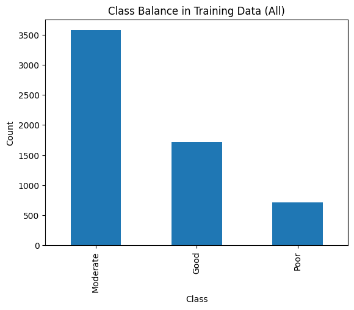
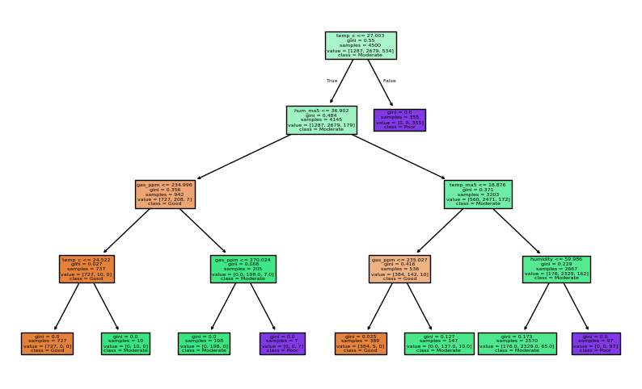

# Smart Desk AI Environment Monitor

[](https://www.python.org/)
[](https://flask.palletsprojects.com/)
[](https://mqtt.org/)
[](https://scikit-learn.org/)

An IoT-style monitoring system that simulates temperature, humidity, and air-quality readings, classifies environmental conditions, and displays live recommendations in a Flask dashboard.

## Why this project matters

The project connects the complete path from device-like telemetry to a user-facing decision: generate sensor readings, transport them over MQTT, classify the environment, and turn the result into clear advice. It demonstrates how a small ML component fits inside a working application rather than existing only in a notebook.

## Architecture

```text
Sensor simulator -> MQTT broker -> Flask dashboard -> live status/advice
                         |
Synthetic training data -> decision-tree model -> evaluation artifacts
```

## Features

- Local and MQTT-based real-time monitoring modes
- Simulated IoT telemetry with realistic drift and environmental spikes
- Good, Moderate, and Poor environment classification
- Model-training and synthetic-data generation scripts
- Browser dashboard with JSON API updates
- Confusion matrix, class-balance, and decision-tree visualizations

## Stack

Python, Flask, NumPy, pandas, scikit-learn, Joblib, and Paho MQTT.

## Run locally

```console
python -m venv .venv
pip install -r requirements.txt
python app.py
```

For MQTT mode, start `app_mqtt.py` and `sim_device.py` in separate terminals. The public test broker is for demonstration only; do not send sensitive data through it.

## Model evaluation


| Training-data balance | Learned decision tree |
| --- | --- |
|  |  |

Generated datasets and trained-model binaries are excluded so the analysis remains reproducible from source.

## Course

CSCI 49000 AIT — Artificial Intelligence for IoT, Fall 2025.

## About the author

Built by **Ahmed Balde** as part of a broader portfolio in Python, backend development, data systems, AI/ML, and application support. See more work on [GitHub](https://github.com/fetachino).
